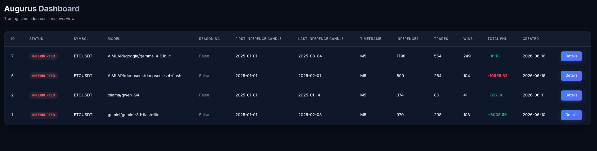
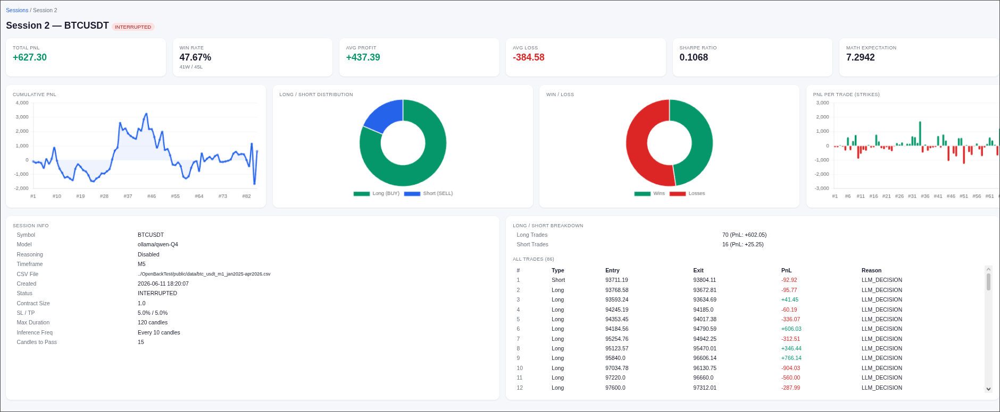

# Augurus LLM Trading Simulator

A CLI tool that simulates trading by parsing CSV candlestick data and using an Ollama or Gemini LLM to make trading decisions in real-time.

This is an experiment to test the profitability of trading using LLMs. This is not financial advice.

## Features (Current)
- Parses historical CSV data (e.g., M1 data) and aggregates to custom timeframes (e.g., M5).
- Connects to Ollama or Gemini for trading decisions.
- About 1M tokens by month (99% input tokens with reasoning off) in models such Gemma4. It depends on how many candle you pass to the model. 
- Prompts are token-optimized: requires minimal structured output from the LLM.
- Calculates PnL, handles fixed contract sizes, and enforces global SL/TP and maximum trade durations.
- SQLite database for storing trades and statistics.
- `--statistics` flag to view PnL and trade history.
- `--continue` flag to continue a previous session.
- **Web Dashboard** (`--http`) — interactive dashboard with session overview, detailed stats, and charts (cumulative PnL, long/short distribution, win rate, strikes, sharpe ratio, math expectation).

## Futurables (To-Dos)
- [ ] **Real-time Live Exchange Feed**: Replace the CSV data feed with a WebSocket connection to Binance or Bybit for live paper trading.
- [ ] **Technical Indicators**: Feed calculated indicators (RSI, MACD, Moving Averages) alongside raw prices to give the LLM better context.
- [ ] **Advanced Risk Management**: Dynamic stop-loss and trailing take-profit, informed by the LLM.
- [x] **Structured Outputs**: Use strict JSON schemas/function calling in Ollama when the feature becomes stable, to guarantee the LLM outputs exact structures.
- [x] **Save input tokens**: Improve current usage for faster calculations and cost reduction.
- [ ] **Upgrade system prompt**: Experiment and check if it improve results.
